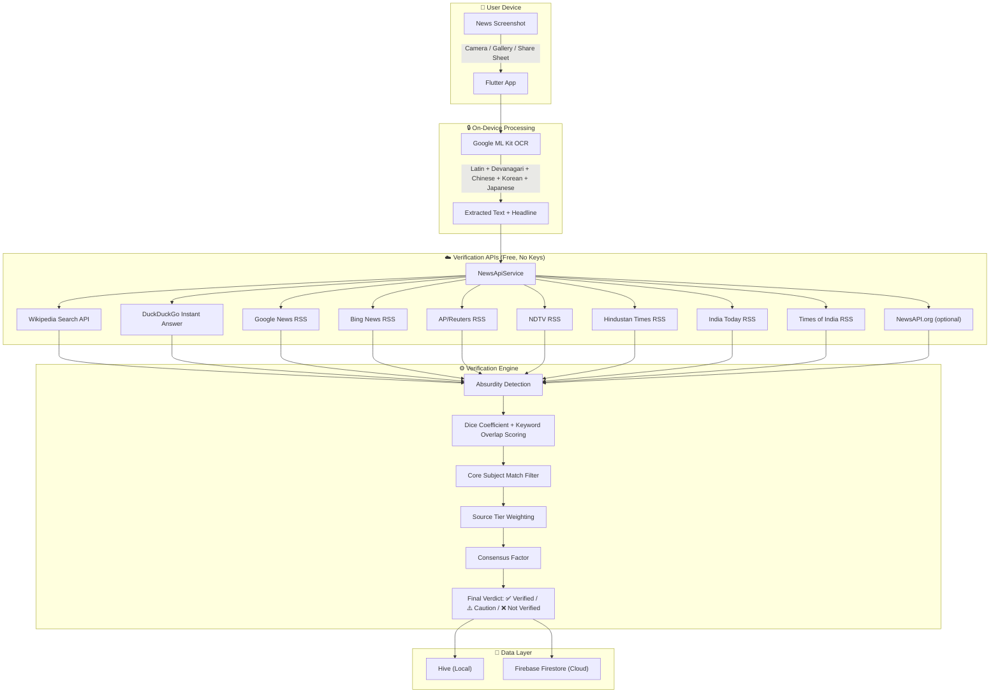
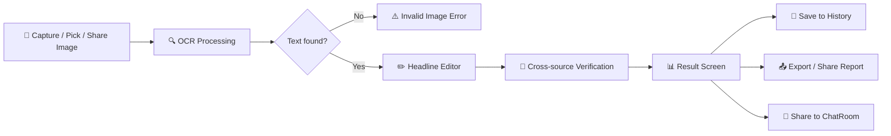
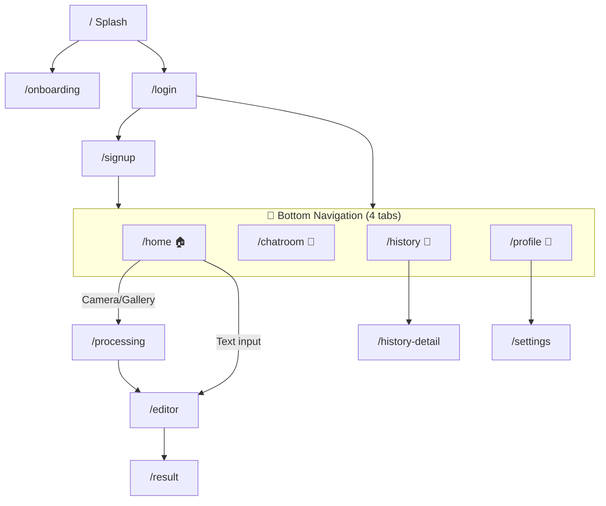
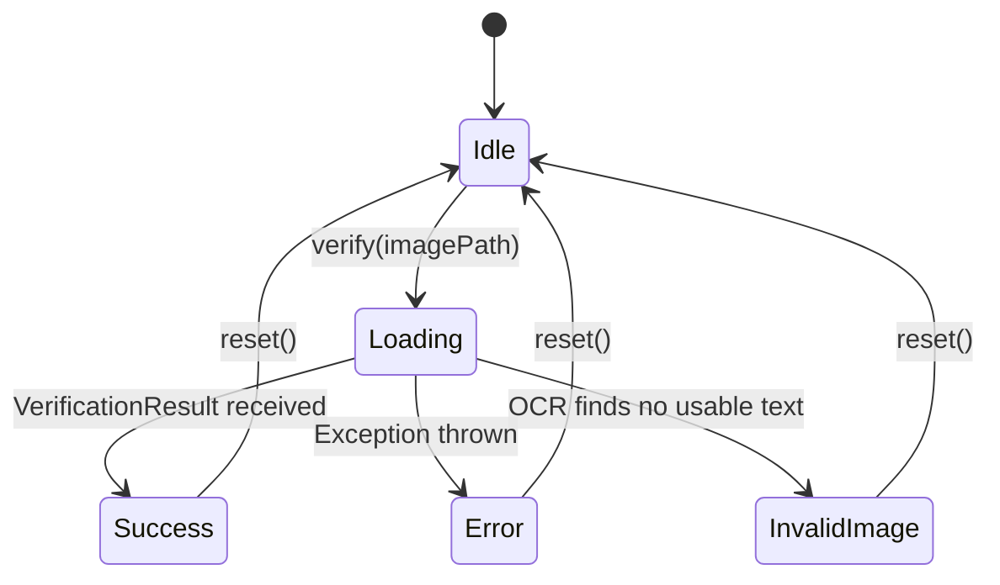

# SachDrishti — Complete Project Walkthrough

> **SachDrishti** (Hindi: "सच दृष्टि" — *True Vision*) is a privacy-first news screenshot verification app built with **Flutter** (Android-focused). Users snap or share a news screenshot, and the app OCR-extracts the headline, then cross-verifies it against 10+ trusted news sources — all without sending the image to any server.

---

## Table of Contents

1. [High-Level Architecture](#1-high-level-architecture)
2. [Technology Stack & Dependencies](#2-technology-stack--dependencies)
3. [Project Structure](#3-project-structure)
4. [Core User Flow](#4-core-user-flow)
5. [Authentication System](#5-authentication-system)
6. [OCR Engine](#6-ocr-engine)
7. [News Verification Pipeline](#7-news-verification-pipeline)
8. [Databases & Storage](#8-databases--storage)
9. [Screens & Navigation](#9-screens--navigation)
10. [State Management](#10-state-management)
11. [Design System](#11-design-system)
12. [Android Native Integration](#12-android-native-integration)
13. [Feature Summary by Phase](#13-feature-summary-by-phase)

---

## 1. High-Level Architecture



---

## 2. Technology Stack & Dependencies

| Layer | Technology | Purpose |
|-------|-----------|---------|
| **Framework** | Flutter 3.x + Dart | Cross-platform UI (Android-focused) |
| **State Management** | `flutter_riverpod` | Providers, StateNotifiers, streams |
| **Navigation** | `go_router` | Declarative routing with auth guards + shell route for bottom nav |
| **OCR** | `google_mlkit_text_recognition` | On-device text extraction (Latin, Devanagari, Chinese, Korean, Japanese) |
| **Local DB** | `hive` + `hive_flutter` | NoSQL key-value store for verification history |
| **Cloud Auth** | `firebase_auth` + `google_sign_in` | Email/password + Google OAuth |
| **Cloud DB** | `cloud_firestore` | User profiles, verification stats, chat messages |
| **Networking** | `http` | REST calls to free news APIs and RSS feeds |
| **Image Picking** | `image_picker` | Camera & gallery access |
| **Sharing** | `share_plus` | Share verification reports |
| **Fonts** | `google_fonts` (Inter) | Typography system |
| **Animations** | `lottie` | Splash & processing animations |
| **Image Cache** | `cached_network_image` | Article thumbnails |
| **Date/Time** | `intl`, `timeago` | Formatting |
| **Storage** | `path_provider`, `shared_preferences` | File paths, API key persistence |
| **Shimmer** | `shimmer` | Loading skeleton effects |

---

## 3. Project Structure

```
sachcheck/
├── android/
│   └── app/src/main/
│       ├── AndroidManifest.xml          # Share sheet intent-filter
│       └── kotlin/.../MainActivity.kt   # Native share image handler
├── lib/
│   ├── main.dart                        # App entry point
│   ├── firebase_options.dart            # Auto-generated Firebase config
│   ├── core/
│   │   ├── router.dart                  # GoRouter config + auth guards + bottom nav shell
│   │   └── theme.dart                   # AppColors + AppTheme (dark/light dual palettes)
│   ├── models/
│   │   ├── history_item.dart            # Hive model (@HiveType) for saved verifications
│   │   ├── history_item.g.dart          # Generated Hive TypeAdapter
│   │   └── verification_result.dart     # Article, SourceTier, Verdict, VerificationResult
│   ├── providers/
│   │   ├── auth_provider.dart           # AuthService + auth state stream + user profile stream
│   │   ├── history_provider.dart        # HistoryNotifier (Hive CRUD)
│   │   └── verification_provider.dart   # VerificationNotifier (OCR → Verify → Result states)
│   ├── services/
│   │   ├── auth_service.dart            # Firebase Auth + Google Sign-In + Firestore profiles
│   │   ├── ocr_service.dart             # Multi-script OCR with headline extraction
│   │   ├── news_api_service.dart        # 10-source article fetcher
│   │   ├── verification_engine.dart     # Scoring, absurdity detection, verdict logic
│   │   ├── category_tagger.dart         # Keyword-based news category classification
│   │   ├── report_generator.dart        # PNG report card generator
│   │   ├── image_storage_service.dart   # Persists screenshots to app documents
│   │   ├── connectivity_service.dart    # Internet connectivity check
│   │   └── share_receiver_service.dart  # MethodChannel bridge for Android share sheet
│   └── screens/
│       ├── splash/                      # Animated splash → onboarding or auth redirect
│       ├── onboarding/                  # First-time user onboarding flow
│       ├── auth/
│       │   ├── login_screen.dart        # Email + Google login
│       │   └── signup_screen.dart       # Email registration
│       ├── home/                        # Main scan hub: camera, gallery, text input
│       ├── processing/                  # OCR + verification loading screen
│       ├── editor/                      # Headline review & edit before verification
│       ├── scanner/                     # Visual text block selector overlay
│       ├── result/                      # Verdict display + matched articles + export
│       ├── history/
│       │   ├── history_screen.dart      # Scrollable list of past verifications
│       │   └── history_detail_screen.dart # Full detail view + offline cached articles
│       ├── chat/                        # Real-time community chatroom
│       ├── profile/                     # User stats + credibility score
│       └── settings/                    # API key configuration
└── assets/
    ├── animations/                      # Lottie JSON files
    └── images/                          # App icon, onboarding images
```

---

## 4. Core User Flow



### Step-by-step:

1. **Image Input** — User captures via camera, picks from gallery, types a headline directly, or shares an image from another app (Android share sheet).

2. **OCR Extraction** — [ocr_service.dart](file:///c:/Users/devic/AndroidStudioProjects/sachcheck/lib/services/ocr_service.dart) runs 5 parallel script recognizers (Latin, Devanagari, Chinese, Korean, Japanese). Picks the recognizer producing the most text. Extracts the most prominent headline using block-area + position scoring.

3. **Headline Review** — [headline_editor_screen.dart](file:///c:/Users/devic/AndroidStudioProjects/sachcheck/lib/screens/editor/headline_editor_screen.dart) shows the image with extracted text. User can edit, or use the visual text scanner overlay to tap-select specific text blocks.

4. **Verification** — [verification_engine.dart](file:///c:/Users/devic/AndroidStudioProjects/sachcheck/lib/services/verification_engine.dart) orchestrates the multi-step pipeline (see [Section 7](#7-news-verification-pipeline)).

5. **Result** — Verdict (Verified ✅ / Needs Caution ⚠️ / Not Verified ❌) displayed with match score, matched articles, category tag, confidence level, and warning flags.

6. **Post-Result Actions** — Save to history, export formatted report, copy to clipboard, share to ChatRoom, search on Google/Wikipedia.

---

## 5. Authentication System

### Firebase Auth

| Method | Implementation |
|--------|---------------|
| **Email/Password Sign-Up** | Creates FirebaseAuth user → sets display name → creates Firestore profile |
| **Email/Password Sign-In** | Standard Firebase email auth |
| **Google Sign-In** | `google_sign_in` → GoogleAuthProvider credential → Firestore profile on first login |
| **Password Reset** | `sendPasswordResetEmail()` |
| **Sign Out** | Signs out of both Google and Firebase |

### Firestore User Profile

Created on first authentication in `users/{uid}`:

```json
{
  "displayName": "John Doe",
  "email": "john@example.com",
  "createdAt": "<server_timestamp>",
  "totalVerifications": 0,
  "verifiedCount": 0,
  "cautionCount": 0,
  "notVerifiedCount": 0
}
```

These counters are atomically incremented (`FieldValue.increment(1)`) after each verification via [auth_service.dart → updateVerificationStats()](file:///c:/Users/devic/AndroidStudioProjects/sachcheck/lib/services/auth_service.dart#L113-L134).

### Auth Guards

[router.dart](file:///c:/Users/devic/AndroidStudioProjects/sachcheck/lib/core/router.dart) uses a `redirect` callback:
- Unauthenticated users → forced to `/login`
- Authenticated users on auth routes → redirected to `/home`
- Splash screen and onboarding → always accessible

---

## 6. OCR Engine

> File: [ocr_service.dart](file:///c:/Users/devic/AndroidStudioProjects/sachcheck/lib/services/ocr_service.dart)

### Multi-Language Support

The `extractWithHeadline()` method runs **5 script recognizers in parallel**:

| Script | Languages Covered |
|--------|-------------------|
| Latin | English, French, Spanish, Portuguese, and all Latin-script languages |
| Devanagari | Hindi, Marathi, Sanskrit, Nepali |
| Chinese | Simplified & Traditional Chinese |
| Korean | Korean |
| Japanese | Japanese (Hiragana, Katakana, Kanji) |

The recognizer that produces the **most text** is selected as the primary result.

### Headline Extraction Algorithm

1. **Block analysis** — Each detected text block has a bounding box with position and area
2. **Filter** — Removes blocks with < 15 chars, < 3 words, and known mastheads (newspaper logos like "Times of India", "NDTV", etc.)
3. **Score** — `area × positionWeight` — larger blocks near the top of the image score highest
4. **Select** — Highest-scoring block chosen as the headline

### Confidence Assessment

| Level | Criteria |
|-------|----------|
| `noText` | No text detected at all |
| `tooShort` | < 4 meaningful words |
| `irrelevant` | Text present but no news-like patterns |
| `lowConfidence` | 4-9 words without strong news signals |
| `good` | 10+ words or news keywords detected |

---

## 7. News Verification Pipeline

### 7.1 Data Sources (10 APIs)

> File: [news_api_service.dart](file:///c:/Users/devic/AndroidStudioProjects/sachcheck/lib/services/news_api_service.dart)

All sources are queried **in parallel** via `Future.wait()`:

| # | Source | Method | Key Required? |
|---|--------|--------|---------------|
| 1 | Wikipedia | REST Search API | ❌ Free |
| 2 | DuckDuckGo | Instant Answer API | ❌ Free |
| 3 | Google News | RSS feed | ❌ Free |
| 4 | Bing News | RSS feed | ❌ Free |
| 5 | AP/Reuters | Google News RSS (site-filtered) | ❌ Free |
| 6 | NDTV | Google News RSS (site-filtered) | ❌ Free |
| 7 | Hindustan Times | Google News RSS (site-filtered) | ❌ Free |
| 8 | India Today | Google News RSS (site-filtered) | ❌ Free |
| 9 | Times of India | Google News RSS (site-filtered) | ❌ Free |
| 10 | NewsAPI.org | REST API | ✅ Optional user-provided key |

All results are **deduplicated by URL** before scoring.

### 7.2 Verification Engine

> File: [verification_engine.dart](file:///c:/Users/devic/AndroidStudioProjects/sachcheck/lib/services/verification_engine.dart)

#### Step 1 — Absurdity / Hoax Pre-Check

Regex patterns detect:
- **Death hoaxes** about prominent figures (Modi, Kohli, Musk, etc.)
- **Fabricated events** (World War 4, alien invasion, nuclear war, etc.)
- **Clickbait language** ("You won't believe", "Shocking truth", "Government hiding")

If detected, the headline is flagged `isAbsurd` and requires **very strong corroboration** (score ≥ 0.65) to pass.

#### Step 2 — Article Scoring

Each fetched article is scored using a multi-factor algorithm:

```
baseScore = (
  (titleDice × 0.35 + titleKeyword × 0.65) × 0.75 +    ← title match (75% weight)
  (descDice × 0.35 + descKeyword × 0.65) × 0.25         ← description match (25% weight)
)
```

Where:
- **Dice Coefficient** — Character bigram similarity (fuzzy matching)
- **Weighted Keyword Overlap** — Significant words matched, weighted by word length (longer words = higher weight)

#### Step 3 — Subject Match Filter

Extracts core subjects (proper nouns, named entities) from the headline. If an article shares keywords but is NOT about the same subject, its score is **penalized by 75%**.

#### Step 4 — Headline Coverage Check

If less than 40% of the headline's significant keywords appear in the article, the score is **halved**.

#### Step 5 — Source Tier Weighting

| Tier | Multiplier | Examples |
|------|-----------|----------|
| 🟢 Established | 1.0× | NDTV, Reuters, BBC, The Hindu, India Today |
| 🟡 Aggregator | 0.9× | Google News, Bing News, DuckDuckGo |
| 🔵 Reference | 0.55× | Wikipedia (matches tangential topics easily) |
| ⚪ Other | 0.5× | Unknown / user-added sources |

#### Step 6 — Consensus Bonus

If **3+ sources** independently score ≥ 0.30 match — adds a **+0.05 consensus bonus** to the final score.

#### Step 7 — Verdict Decision

| Condition | Verdict | Confidence |
|-----------|---------|------------|
| `isAbsurd && score < 0.65` | ❌ Not Verified | High |
| `score ≥ 0.55` | ✅ Verified | High (3+ sources) or Medium |
| `score ≥ 0.30` | ⚠️ Needs Caution | Medium |
| `score < 0.30` | ❌ Not Verified | Medium or High |

### 7.3 Category Tagging

> File: [category_tagger.dart](file:///c:/Users/devic/AndroidStudioProjects/sachcheck/lib/services/category_tagger.dart)

Keyword-based classification into: **Politics 🏛️ • Health 🏥 • Science 🔬 • Finance 💰 • Sports ⚽ • Technology 💻 • Entertainment 🎬 • General 📰**

---

## 8. Databases & Storage

### 8.1 Hive (Local — On-Device)

> **Purpose**: Offline-first verification history, persists across app restarts

| Box | Model | Key Fields |
|-----|-------|------------|
| `history` | [HistoryItem](file:///c:/Users/devic/AndroidStudioProjects/sachcheck/lib/models/history_item.dart) | `id`, `headline`, `verdict`, `score`, `checkedAt`, `imagePath`, `matchedArticlesJson`, `category` |

#### Schema: `HistoryItem` (HiveType 0)

| Field | Type | Description |
|-------|------|-------------|
| `id` | String | UUID v4 |
| `headline` | String | Extracted/edited headline |
| `verdict` | String | `'verified'`, `'needs_caution'`, or `'not_verified'` |
| `score` | double | 0.0 – 1.0 match score |
| `checkedAt` | DateTime | Verification timestamp |
| `imagePath` | String | Path to persisted screenshot in app documents |
| `matchedArticlesJson` | String? | JSON-encoded list of matched articles (offline cache) |
| `category` | String? | News category tag |

#### Offline Cache

When a verification result is saved, `matchedArticles` are serialized to JSON and stored in `matchedArticlesJson`. The [HistoryDetailScreen](file:///c:/Users/devic/AndroidStudioProjects/sachcheck/lib/screens/history/history_detail_screen.dart) decodes this JSON on-demand to display article cards with an **"Available offline"** badge.

#### Image Persistence

Screenshots are copied from the temp cache to `<appDocumentsDir>/sachcheck_images/` via [ImageStorageService](file:///c:/Users/devic/AndroidStudioProjects/sachcheck/lib/services/image_storage_service.dart) so they survive OS cache clearing.

### 8.2 Firebase Firestore (Cloud)

> **Purpose**: User profiles, verification stats, real-time chat

#### Collection: `users/{uid}`

```json
{
  "displayName": "string",
  "email": "string",
  "createdAt": "timestamp",
  "totalVerifications": 0,
  "verifiedCount": 0,
  "cautionCount": 0,
  "notVerifiedCount": 0
}
```

Updated atomically with `FieldValue.increment(1)` after each verification.

#### Collection: `messages/{messageId}`

```json
{
  "text": "string",
  "userId": "string (uid)",
  "userName": "string",
  "timestamp": "serverTimestamp",
  "type": "text | verification_share | image",
  "verificationData": {                    // only for type: verification_share
    "headline": "string",
    "verdict": "string",
    "score": 0.0
  },
  "imageData": "base64-encoded image"      // only for type: image
}
```

### 8.3 SharedPreferences (Key-Value)

| Key | Purpose |
|-----|---------|
| `news_api_key` | User-provided NewsAPI.org key (optional) |

### 8.4 Firebase Auth

Manages user sessions, tokens, and OAuth credentials. Project ID: `sachdrishti`.

---

## 9. Screens & Navigation

### Route Map



### Screen Descriptions

| Screen | File | Purpose |
|--------|------|---------|
| **Splash** | `splash_screen.dart` | Animated intro → auto-redirect to onboarding or home |
| **Onboarding** | `onboarding_screen.dart` | First-time user feature walkthrough |
| **Login** | `login_screen.dart` | Email/password + Google Sign-In |
| **Signup** | `signup_screen.dart` | Email registration with display name |
| **Home** | `home_screen.dart` | Hero section + Scan Now / Gallery / Type & Verify buttons + handles shared images |
| **Processing** | `processing_screen.dart` | OCR extraction animation + auto-redirects to editor or shows error |
| **Editor** | `headline_editor_screen.dart` | Image preview + editable headline field + "Scan Text" visual overlay |
| **Scanner** | `text_scanner_screen.dart` | Visual overlay showing all detected text blocks, tap to select |
| **Result** | `result_screen.dart` | Verdict badge + matched articles + score bar + export/copy/chat buttons |
| **History** | `history_screen.dart` | Scrollable list of past verifications with swipe-to-delete |
| **History Detail** | `history_detail_screen.dart` | Full detail view + offline cached articles + export + screenshot |
| **ChatRoom** | `chatroom_screen.dart` | Real-time Firestore chat with text, images, and verification shares |
| **Profile** | `profile_screen.dart` | Avatar, credibility score, stats grid, settings, sign out |
| **Settings** | `settings_screen.dart` | NewsAPI.org key configuration |

---

## 10. State Management

Uses `flutter_riverpod` with sealed state classes.

### Providers

| Provider | Type | Purpose |
|----------|------|---------|
| `authServiceProvider` | `Provider<AuthService>` | Auth service singleton |
| `authStateProvider` | `StreamProvider<User?>` | Firebase auth state stream |
| `userProfileStreamProvider` | `StreamProvider<Map?>` | Real-time Firestore user profile |
| `historyProvider` | `StateNotifierProvider` | Hive-backed history CRUD |
| `ocrServiceProvider` | `Provider<OcrService>` | OCR service singleton |
| `newsApiServiceProvider` | `Provider<NewsApiService>` | News fetcher singleton |
| `verificationEngineProvider` | `Provider<VerificationEngine>` | Verification engine |
| `verificationProvider` | `StateNotifierProvider` | Stateful verification flow |

### Verification State Machine



States: `VerificationIdle → VerificationLoading → VerificationSuccess | VerificationError | VerificationInvalidImage`

---

## 11. Design System

> File: [theme.dart](file:///c:/Users/devic/AndroidStudioProjects/sachcheck/lib/core/theme.dart)

### Color Palette

| Token | Dark Mode | Light Mode |
|-------|-----------|------------|
| Background | `#0D0D1A` | `#F5F5FF` |
| Surface | `#1A1A2E` | `#FFFFFF` |
| Primary | `#6C63FF` | `#6C63FF` |
| Accent | `#00D4FF` | `#00D4FF` |
| Verified | `#00E676` 🟢 | `#00E676` |
| Caution | `#FFD600` 🟡 | `#FFD600` |
| Not Verified | `#FF5252` 🔴 | `#FF5252` |

### Typography

**Google Fonts Inter** — applied globally via `GoogleFonts.interTextTheme()`.

### Theme Mode

Follows device system setting (`ThemeMode.system`). The app builds both `AppTheme.dark` and `AppTheme.light` and applies them via `MaterialApp.router`.

---

## 12. Android Native Integration

### Share Sheet Receiver

Allows users to share images from Gallery, WhatsApp, Twitter, etc. directly into SachDrishti.

#### AndroidManifest.xml

```xml
<intent-filter>
    <action android:name="android.intent.action.SEND"/>
    <category android:name="android.intent.category.DEFAULT"/>
    <data android:mimeType="image/*"/>
</intent-filter>
```

#### MainActivity.kt

- Handles `Intent.ACTION_SEND` in `configureFlutterEngine` and `onNewIntent`
- Copies shared image from content URI to a temp file in cache directory (ensures Flutter can access it)
- Exposes `getSharedImage()` and `clearSharedImage()` via Flutter `MethodChannel("com.sachcheck.sachcheck/share")`

#### Share Receiver Service (Dart side)

[share_receiver_service.dart](file:///c:/Users/devic/AndroidStudioProjects/sachcheck/lib/services/share_receiver_service.dart) bridges the native MethodChannel to Flutter, providing `getSharedImage()` and `clearSharedImage()`.

#### App Startup Flow

1. `main.dart` calls `ShareReceiverService.getSharedImage()` before `runApp()`
2. If a path is returned, it's stored in the global `pendingShareImagePath`
3. `HomeScreen.initState()` checks this value and auto-navigates to `/processing`

---

## 13. Feature Summary by Phase

### Phase 1 — Core ✅

| Feature | Status |
|---------|--------|
| Firebase Auth (Email + Google) | ✅ |
| On-device OCR with ML Kit | ✅ |
| Multi-source news verification (10 APIs) | ✅ |
| Verification result screen with articles | ✅ |
| Hive-based verification history | ✅ |
| Dark/light theme with system auto-detect | ✅ |
| GoRouter navigation with auth guards | ✅ |
| Bottom navigation (Home, Chat, History, Profile) | ✅ |

### Phase 2 — Social & Polish ✅

| Feature | Status |
|---------|--------|
| Real-time Firestore chatroom | ✅ |
| Image sharing in chatroom (base64) | ✅ |
| Verification sharing to chatroom | ✅ |
| Headline editor with visual text scanner | ✅ |
| Absurdity/hoax detection | ✅ |
| Source reliability tiers (Established/Aggregator/Reference/Other) | ✅ |
| Category tagging (Politics, Sports, Tech, etc.) | ✅ |
| Export verification reports | ✅ |
| PNG report card generation | ✅ |
| User credibility score on profile | ✅ |
| Additional Indian news sources (NDTV, HT, India Today, TOI) | ✅ |
| Screenshot persistence for history | ✅ |

### Phase 3 — Offline & Accessibility ✅

| Feature | Status |
|---------|--------|
| Offline verification cache (matched articles in Hive) | ✅ |
| "Available offline" badge in history detail | ✅ |
| Android share sheet integration | ✅ |
| Enhanced export with source reliability tiers | ✅ |
| Copy to clipboard functionality | ✅ |
| Multi-language OCR (Hindi, Chinese, Korean, Japanese) | ✅ |

---

> **Privacy Note**: SachDrishti is privacy-first. All OCR processing happens **on-device** using Google ML Kit. News screenshots are never uploaded to any server. Only text headlines are sent as search queries to public news APIs.
